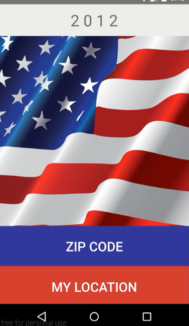
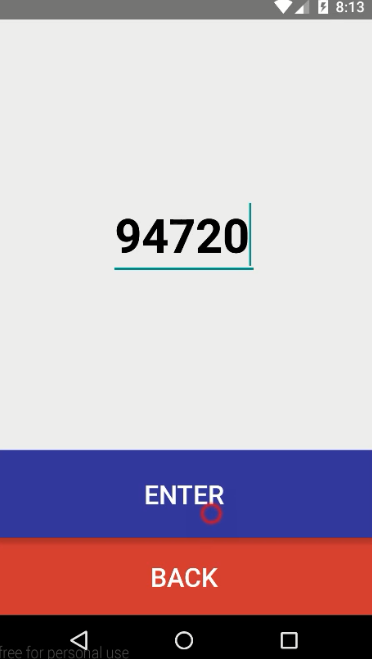
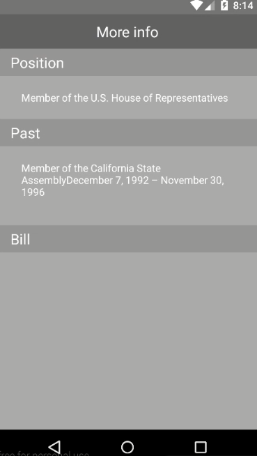
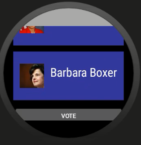
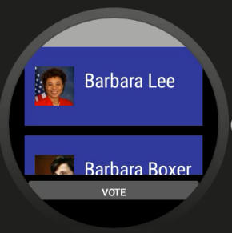
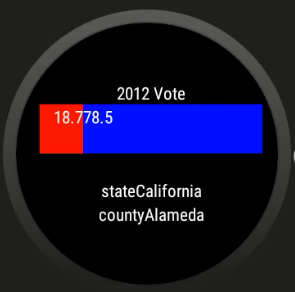

# PROG 02: Represent!

A mobile and smartwatch application to deliver facts to voters on the go

## Authors

Jiachen Hu ([jc-hu@berkeley.edu](mailto:jc-hu@berkeley.edu))

## Demo Video

See [https://youtu.be/el2hDo91cMs] (https://youtu.be/el2hDo91cMs)

## Screenshots

## Acknowledgments

* Hat tip to anyone who's code was used
* Any other support
